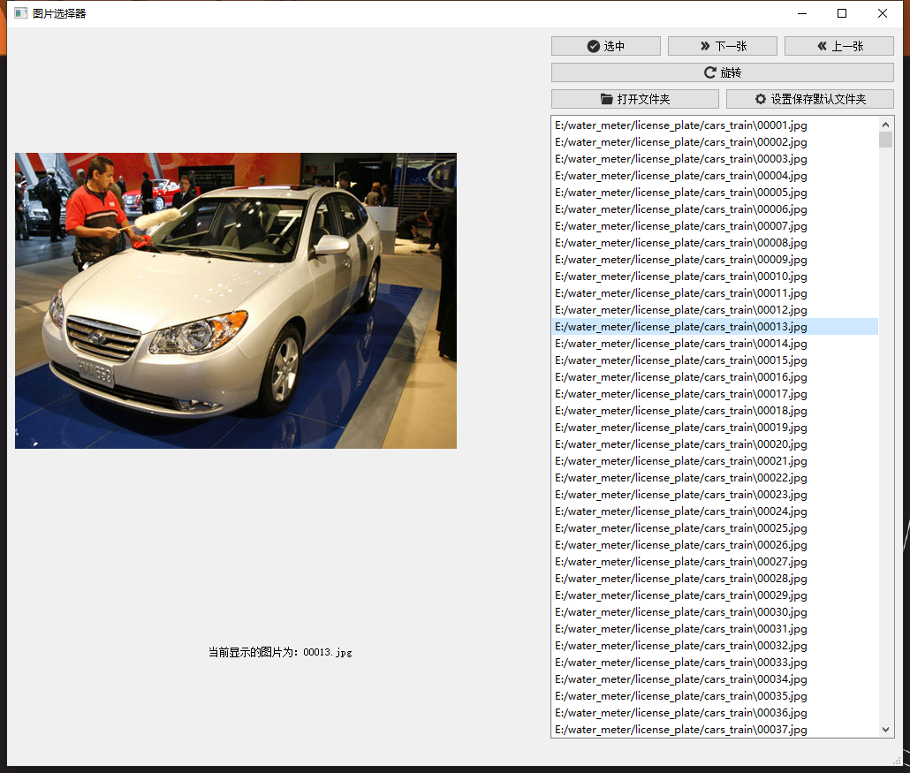
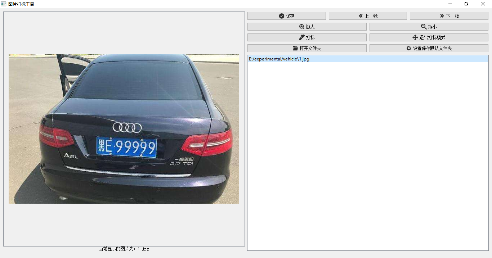
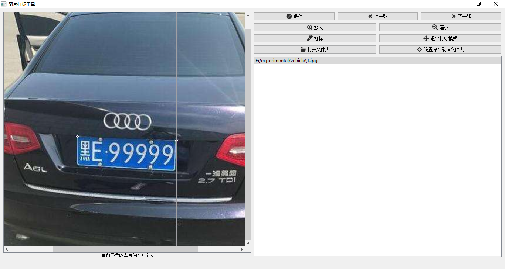

### 工程说明

这里面有两个程序，GUI是用来选择图片的软件; ImageMarking也是给图片打标的软件，一张图片只能打标一个物体，并且是打标四个点
顺序分别是左上、右上、右下、左下

### 目录介绍

####  GUI: 可以用来选择图片，软件界面如下所示：

该软件的功能是选中一个文件夹中符合要求的图片到另一个文件夹。该软件预设一些快捷键（键盘上的字母）

- e :下一张
- w : 上一张
- Enter : 保存选中的图片到指定的默认文件夹
- r : 旋转图片

### ImageMarking: 给图像打标的工具

该软件可以打标一个图像目标里面的四个点, 有图片放大、缩小等功能，当图像太大时，会出现滚动条，可以拖动滚动条来查看完整图像

软件界面如下

放大图片

(注意：软件的缩小功能不能缩小的比原图更小，只能先放大再缩小)

打标模式

软件快捷键如下：

- w : 上一张
- e ：下一张
- Esc ：退出打标模式
- q ：打标模式
- ctrl + + ：放大图片
- ctrl + - ：缩小图片