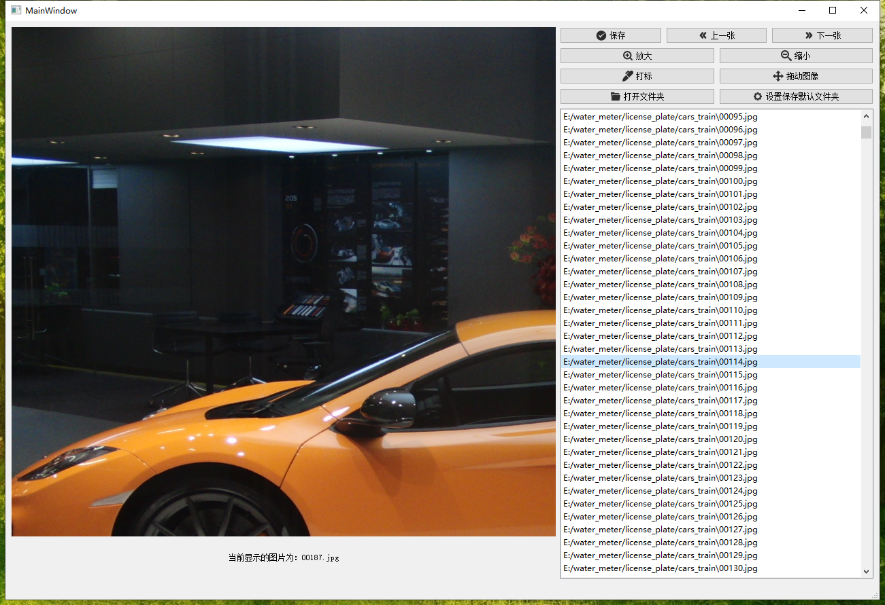
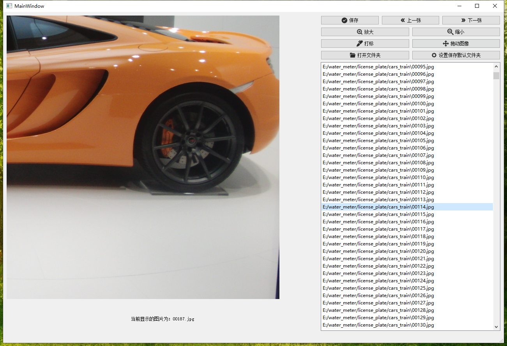
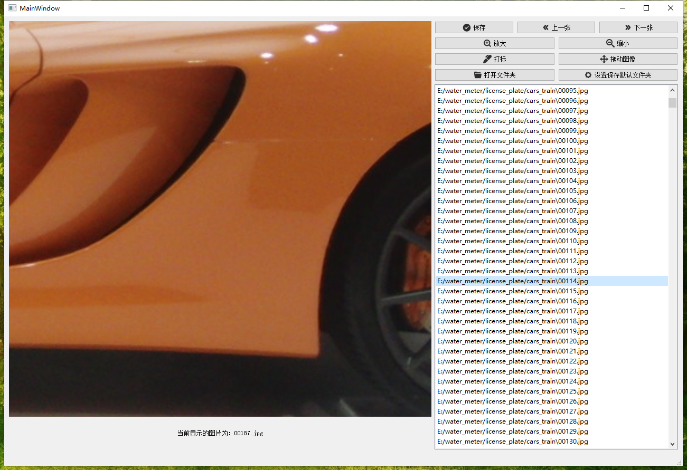

### 工程说明

这里面有两个程序，GUI是用来选择图片的软件，labelGUI是用来给图片打标的软件, ImageMarking也是给图片打标的软件，是labelGUI的增强版本

### 目录介绍

####  GUI: 可以用来选择图片，软件界面如下所示：

该软件的功能是选中一个文件夹中符合要求的图片到另一个文件夹。该软件预设一些快捷键（键盘上的字母）

- e :下一张
- w : 上一张
- Enter : 保存选中的图片到指定的默认文件夹
- r : 旋转图片

### labelGUI:给图片打标的软件，软件界面如下所示：

该软件的功能是给一张图片打标，目的是为了框出车牌的四个点，使用鼠标左键点击车牌的四个点，然后直接直接得到训练需要的坐标（如上图中的四个红色四个小圆圈，就是给车牌定位的四个点），软件的快捷键如下（键盘上的字母）：

- w : 下一张
- e : 上一张
- s : 保存txt到指定的默认目录

### ImageMarking: 给图像打标的增强版本

该软件增强了上一个软件的功能，加入了给图片放大、缩小、以及拖动图像的功能（注意：图片的拖动只能往左上拖动，剩余方向的拖动没有必要，所以没有实现）

软件界面如下

拖动图片的功能

放大图片，该功能的的放大区域是方法鼠标所在地方，默认鼠标所在地方相对不动

软件快捷键如下：

- w : 上一张
- e ：下一张
- d ：拖动模式
- a ：打标模式
- ctrl + + ：放大图片
- ctrl + - ：缩小图片